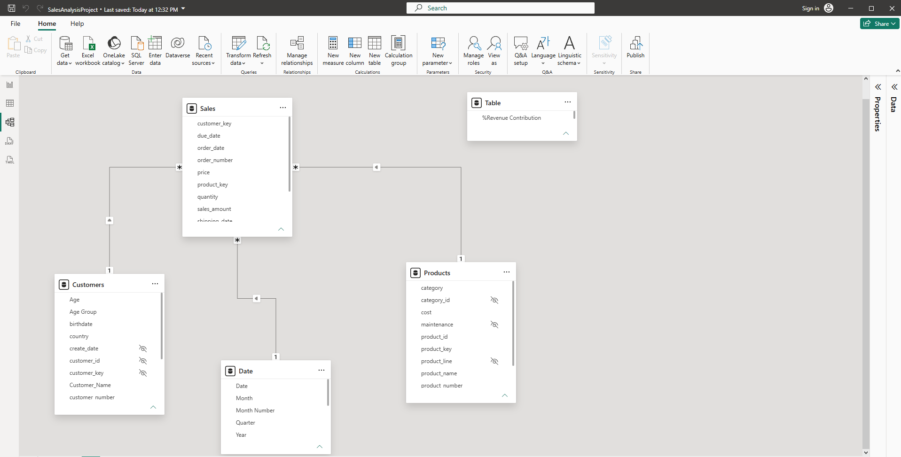
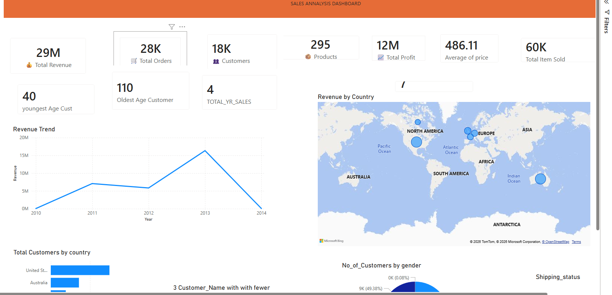
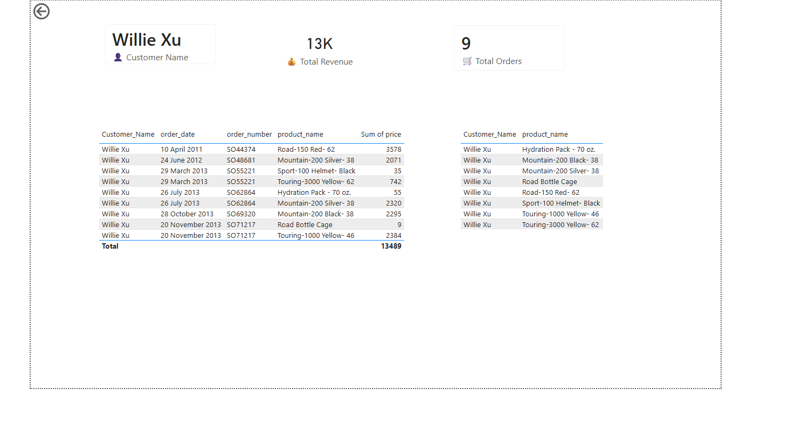
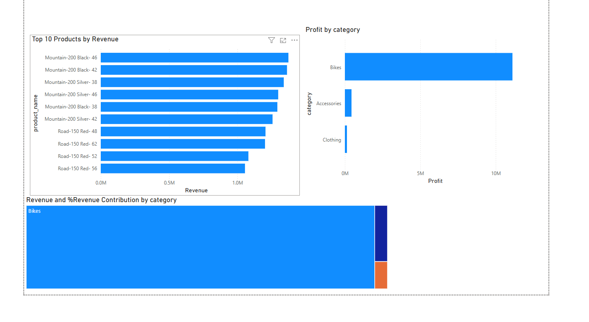
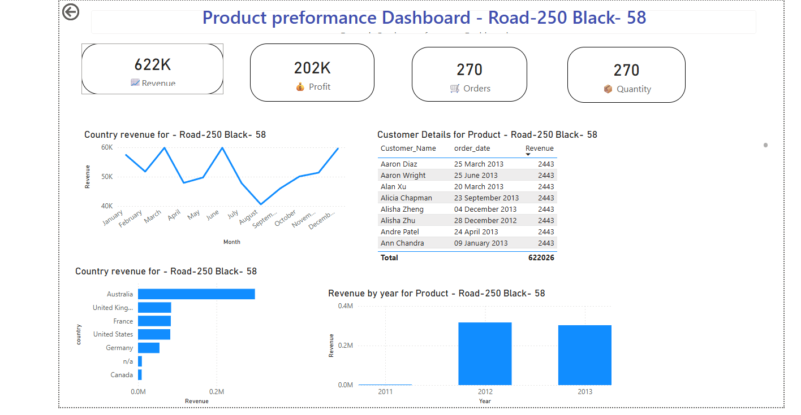

# Sales Analytics Dashboard

## Project Overview
---

This project focuses on building an interactive **Sales Analytics Dashboard** using **SQL and Power BI**. The purpose of this project is to analyze sales performance, customer purchasing behavior, product performance, and profitability.

The dashboard transforms raw sales data into meaningful business insights through data cleaning, data modeling, DAX calculations, and interactive visualizations. It helps users understand revenue trends, identify high-performing products, analyze customer behavior, and evaluate profitability.

---

## Business Objectives
The main objectives of this project are:

- Analyze overall sales and profit performance
- Track revenue and order trends over time
- Identify top-performing products and categories
- Understand customer purchasing patterns
- Analyze product profitability and profit margins
- Support data-driven business decisions

---

## Tools & Technologies
The following tools and technologies were used:

- **Power BI Desktop** - Dashboard development and data visualization
- **SQL** - Data cleaning and exploratory data analysis
- **DAX** - Creating calculated measures and KPIs
- **CSV Files** - Data storage and source files
- **GitHub** - Project documentation and version control

---

## Dataset
### Sales.csv
Contains transaction-level sales information including:
- Order ID
- Order Date
- Customer ID
- Product ID
- Quantity
- Sales Amount
- Cost

### Customers.csv
Contains customer information including:
- Customer ID
- Customer Name
- Location
- Customer details

### Products.csv
Contains product information including:
- Product ID
- Product Name
- Category
- Subcategory

### Date.csv
Contains date-related information used for time-based analysis:
- Date
- Year
- Month
- Quarter

---

## Dashboard Pages
The Power BI report contains the following analysis pages:

## 1. Executive Dashboard

Provides a high-level overview of business performance.

Key metrics:
- Total Revenue
- Total Profit
- Total Orders
- Total Customers
- Sales Trend Analysis
- Revenue Contribution by Category

---

## 2. Customer Insights

Analyzes customer purchasing behavior.

Includes:

- Customer Purchase History
- Total Purchases by Customer
- Number of Orders per Customer
- Products Purchased
- Top Customers by Revenue

---

## 3. Product Insights

Analyzes product performance.

Includes:

- Revenue by Product
- Revenue by Category
- Top Performing Products
- Product Revenue Contribution
- Product Performance Comparison

---

## 4. Profit Analysis

Focuses on profitability.

Includes:

- Profit Trend Over Time
- Profit by Category
- Profit Margin by Product
- Revenue vs Profit Analysis
- Identification of high-profit products

---

## Key Insights

The dashboard provides the following business insights:

- Bikes contribute the highest share of overall revenue.
- Top-performing products generate a significant portion of total sales.
- Customer purchasing behavior helps identify valuable customers.
- Some products generate high revenue but have lower profit margins.
- Profitability varies across different product categories.
- Sales trends help identify high and low-performing periods.

---

## Data Model

The project follows a **star schema data model**.
The dashboard is built using a **star schema** data model, which improves query performance and simplifies reporting in Power BI.

The **Sales** table serves as the central fact table and stores transaction-level information such as sales amount, order quantity, revenue, and cost. It is connected to three dimension tables:

- **Customers** – Contains customer details used for customer analysis and segmentation.
- **Products** – Contains product information such as product name, category, and subcategory for product performance analysis.
- **Date** – Provides calendar attributes including year, quarter, month, and day to support time-based analysis.

### Table Relationships

| Table | Related Table | Relationship |
|--------|---------------|--------------|
| Customers | Sales | CustomerID (1:Many) |
| Products | Sales | ProductID (1:Many) |
| Date | Sales | OrderDate (1:Many) |

This model enables efficient filtering across the report and supports accurate calculations using DAX measures. It also follows Power BI best practices by separating transactional data from descriptive attributes, making the dashboard scalable and easy to maintain.

### Data Model Diagram

The diagram below illustrates the relationships between the tables used in this project.



The Power BI report contains the following analysis pages:

## 1. Executive Dashboard

Provides a high-level overview of business performance.

Key metrics:
- Total Revenue
- Total Profit

## Dashboard Pages
## 1️⃣ Executive Sales Dashboard

This dashboard provides a high-level overview of business performance.

### Key Metrics
- Best Year
- Best Month
- Best Category
- Best Product
- Best Customer
- Top Country
- Year-over-Year Growth (YoY)

### Business Value
Provides management with a quick summary of overall sales performance and highlights the top-performing business areas.

---

## 2️⃣ Sales Analysis Dashboard

This page analyzes sales performance across multiple business dimensions.

### KPIs
- Total Revenue
- Total Profit
- Total Orders
- Total Customers
- Total Products Sold
- Average Selling Price

### Visualizations
- Revenue Trend
- Revenue by Country
- Customer Distribution by Country
- Customer Distribution by Gender
- Revenue Map
- Youngest and Oldest Customer
- Lowest Ordering Customers

### Business Value
Helps identify customer distribution, geographical performance, revenue trends, and overall business growth.

---

## 3️⃣ Category Analysis Dashboard

This dashboard focuses on product category performance.

### Visualizations
- Revenue by Category
- Sales Amount by Category
- Number of Products by Category
- Average Product Cost by Category
- Revenue by Customer
- Revenue by Product
- Revenue by Age Group
- Revenue Contribution by Category

### Business Value
Identifies the most profitable product categories and customer segments to support strategic business decisions.

---

## 4️⃣ Time Intelligence Dashboard

This dashboard analyzes business performance over time using DAX Time Intelligence functions.

### Visualizations
- Revenue by Year
- Revenue by Quarter
- Running Sales
- Total Year-To-Date (YTD)
- YoY Growth
- Revenue by Month

### Features
- Running Total
- Year-To-Date (YTD)
- Year-over-Year (YoY)
- Quarterly Analysis

### Business Value
Allows stakeholders to evaluate historical performance and monitor business growth trends over time.

---

## 5️⃣ Profit Analysis Dashboard

This dashboard focuses on profitability analysis.

### Visualizations
- Profit by Product
- Profit by Category
- Profit by Year
- Top 10 Customers by Profit
- Profit Margin by Product
- Revenue Contribution by Category

### Business Value
Helps identify high-profit products, profitable customers, and categories contributing the most to overall business profit.

---

## 6️⃣ Product Performance Dashboard

This dashboard provides detailed analysis for an individual product.

### KPIs
- Revenue
- Profit
- Orders
- Quantity Sold

### Visualizations
- Monthly Revenue
- Revenue by Country
- Revenue by Year
- Customer Details

### Business Value
Supports product-level performance monitoring and helps identify sales trends for individual products.

---

## 7️⃣ Customer Details Dashboard

This dashboard provides detailed information about customer purchases.

### Information Included
- Customer Name
- Total Revenue
- Total Orders
- Order Date
- Order Number
- Products Purchased
- Sales Amount

### Business Value
Provides detailed customer purchase history for customer relationship management and sales analysis.

---

## 8️⃣ Top Products Dashboard

This dashboard highlights the best-performing products.

### Visualizations
- Top 10 Products by Revenue
- Revenue Contribution by Category
- Profit by Category

### Business Value
Helps business users identify high-performing products and prioritize inventory and marketing strategies.

---

# 🛠️ Tools & Technologies

- Microsoft Power BI Desktop
- Power Query
- DAX (Data Analysis Expressions)
- Data Modeling
- Star Schema
- Time Intelligence Functions

---

# 📈 Power BI Features Used

- Interactive Slicers


## Key Insights
- 📈 Total revenue reached **29M**, generating an overall **profit of 12M**, indicating strong business performance.

- 🚲 **Bikes** is the highest-performing product category, contributing the largest share of both revenue and profit.

- 🌍 The **United States** is the top-performing market, generating the highest revenue compared to other countries.

- 🏆 **Jordan Turner** is the highest-value customer, contributing the most revenue and profit.

- 🚴 **Mountain-200 Black-46** is the best-selling product, making it the top revenue-generating product.

- 📅 **2013** recorded the highest annual sales, showing significant business growth compared to previous years.

- 📊 Revenue shows a consistent upward trend across the years, with a positive **Year-over-Year (YoY) Growth of 1.12**.

- 💰 Profit analysis shows that the **Bikes** category contributes more than **95% of total profit**, making it the primary driver of business profitability.

- 👥 Customer distribution is almost evenly split between male and female customers, indicating balanced customer demographics.

- 📦 The business processed approximately **28K orders** from **18K customers**, selling around **60K items** across **295 products**.

- 📈 Time Intelligence analysis (Running Total, YTD, and YoY) helps monitor business growth and evaluate sales performance over different time periods.

- 🌎 Geographic analysis highlights opportunities to expand sales in countries with lower revenue while maintaining strong performance in the United States.

- 🎯 Product-level analysis identifies the highest-performing products and helps prioritize inventory, pricing, and marketing strategies.

- 🤝 Customer-level analysis enables the business to identify loyal customers and develop targeted marketing and retention strategies.

# 💡 Business Recommendations

- Increase marketing investment for the Bikes category, as it generates the highest revenue and profit.
- Focus customer retention strategies on high-value customers such as Jordan Turner.
- Expand sales efforts in lower-performing countries to increase market share.
- Promote top-selling products through targeted campaigns to maximize revenue.
- Monitor YoY and YTD performance regularly to identify seasonal sales trends.
- Review low-performing products and consider promotional offers or inventory optimization.

## Repository Structure

The repository is organized into separate folders to keep the project structured and easy to navigate.

```
Sales-Analytics-Dashboard/
│
├── Dataset/
│   ├── Sales.csv
│   ├── Customers.csv
│   ├── Products.csv
│   └── Date.csv
│
├── SQL/
│   ├── init_database_setup.sql
│   └── Exploratory_Data_Analysis.sql
│
├── PowerBI/
│   ├── Sales_Dashboard.pbix
│   └── Dashboard_Screenshot.png
│
├── Documentation/
│   ├── Sales_Analytics_Portfolio_Project.pdf
│   ├── Data_Model.png
│   ├── Dashboard.png
│   └── Project_Report.pdf
│
├── README.md
└── LICENSE
```

### Folder Description

- **Dataset/** – Contains the CSV files used in the project, including sales transactions, customer information, product details, and the date dimension.

- **SQL/** – Contains SQL scripts used for data cleaning and exploratory data analysis (EDA), helping prepare the data before importing it into Power BI.

- **PowerBI/** – Contains the Power BI report (`.pbix`) and a screenshot of the completed dashboard.

- **Documentation/** – Contains supporting project documentation, including the project report, dashboard screenshots, the data model, and portfolio documentation.

- **README.md** – Provides an overview of the project, objectives, tools used, dashboard features, repository structure, and key insights.

- **LICENSE** – Specifies the licensing terms for the project.
Why include this?

This section shows that your project is well organized and makes it easy for recruiters or h
## Documentation

Detailed project documentation is available in the **Documentation** folder.

It includes:

- Complete project report
- Dashboard screenshots
- Data model diagram
- Portfolio project explanation

---

## Dashboard Preview

### Executive Dashboard


### Customer Insights


### Product Insights


### Profit Analysis


## Author
**Menaka Narayanasamy**

LinkedIn:[LinkedIn profile link](https://www.linkedin.com/in/menaka-narayanasamy-8a5588a1/)

GitHub: [GitHub profile link](https://github.com/menakabasu/Sales-Analytics-Dashboard)
